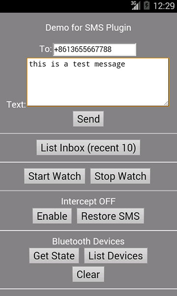

# cordova-plugin-sms #

Plugin to operate SMS, send / list / intercept / delete / restore.

### How to Use? ###

Use the plugin with Cordova CLI (v5.x or above):
```bash
cordova plugin add cordova-plugin-sms
```

When use with PhoneGap Build, write following line in your config.xml:
```xml
<gap:plugin name="cordova-plugin-sms" source="npm" />
```

# API Overview #

### Methods ###

```javascript
sendSMS(address(s), text, successCallback, failureCallback);
listSMS(filter, successCallback, failureCallback);
deleteSMS(filter, successCallback, failureCallback);

startWatch(successCallback, failureCallback);
stopWatch(successCallback, failureCallback);

enableIntercept(on_off, successCallback, failureCallback);
restoreSMS(msg_or_msgs, successCallback, failureCallback);

setOptions(options, successCallback, failureCallback);
```

### Events ###

```javascript
'onSMSArrive'
```

### Quick Start ###

```bash
	# create a demo project
    cordova create test1 com.rjfun.test1 Test1
    cd test1
    cordova platform add android
    
    # now add plugin
    cordova plugin add cordova-plugin-sms
    
    # copy the demo file
    rm -r www/*; cp plugins/cordova-plugin-sms/test/* www/;
    
	# now build and run the demo in your device or emulator
    cordova prepare; 
    cordova run android; 
    
    # or import into Xcode / eclipse
```

### Documentation ###

Check the [API Reference](https://github.com/floatinghotpot/cordova-plugin-sms/blob/master/docs/)

Check the [Example Code in test/index.html](https://github.com/floatinghotpot/cordova-plugin-sms/blob/master/test/index.html).

### Demo ###



### Credits ###

The plugin is created and maintained by Raymond Xie.

You can use it for FREE, it works in trial mode by default.

[A valid license](https://www.paypal.com/cgi-bin/webscr?cmd=_s-xclick&hosted_button_id=86JSRPJDQUMRU) is required to get email support, or use it in commercial product.

## See Also ##

More Cordova/PhoneGap plugins by Raymond Xie, [visit http://rjfun.github.io/](http://rjfun.github.io/).

Cordova/PhoneGap plugins for the world leading Mobile Ad services:

* [AdMob PluginPro](https://github.com/floatinghotpot/cordova-admob-pro), for Google AdMob/DoubleClick.
* [iAd PluginPro](https://github.com/floatinghotpot/cordova-plugin-iad), for Apple iAd. 
* [FacebookAds PluginPro](https://github.com/floatinghotpot/cordova-plugin-facebookads), for Facebook Audience Network.
* [FlurryAds PluginPro](https://github.com/floatinghotpot/cordova-plugin-flurry), for Flurry Ads.
* [mMedia PluginPro](https://github.com/floatinghotpot/cordova-plugin-mmedia), for Millennial Meida.
* [MobFox PluginPro](https://github.com/floatinghotpot/cordova-mobfox-pro), for MobFox.
* [MoPub PluginPro](https://github.com/floatinghotpot/cordova-plugin-mopub), for MoPub.

Project outsourcing and consulting service is also available. Please [contact us](http://floatinghotpot.github.io) if you have the business needs.

